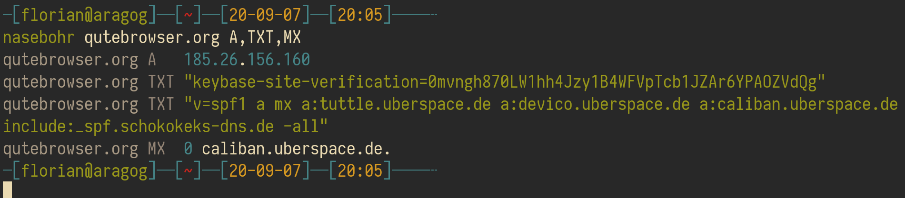

# nasebohr

A command-line tool for DNS queries, with colors and beautiful output

## FAQ

### What does the name mean?

The German "nasebohr" literally means "nose-bore", but loosely translates to
"picking one's nose". Given that existing DNS client utilities are named
[dig](https://en.wikipedia.org/wiki/Dig_(command)) and
[drill](https://linux.die.net/man/1/drill), "bohr" seems like a logical
evolution. Given that we're looking at **na**me **se**rvers, the "nase" is more
than fitting as well.
